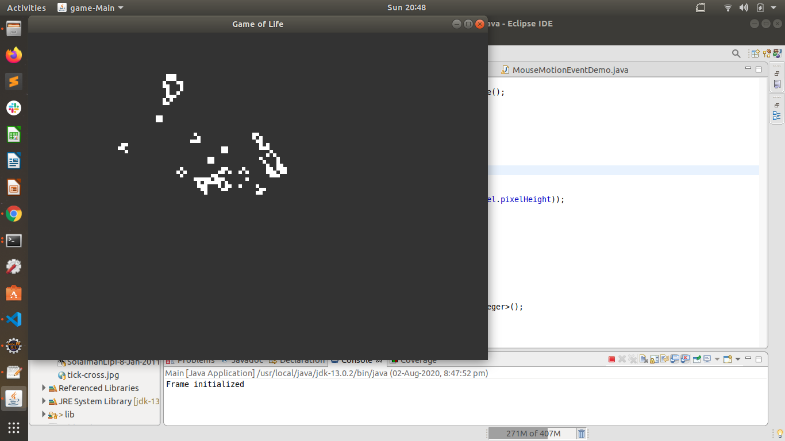
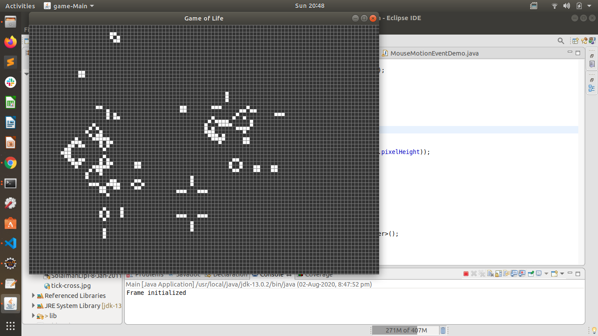

# Conway's Game of Life Implementation

This repository contains the Java implementaiton of Conways' Game of life.
It's a zero player game based on cellular Automation. The evaluation of a cell is determined by it's initial state and it's neighbouring cells.For more info look into this [link](https://en.wikipedia.org/wiki/Conway%27s_Game_of_Life).

For this implementation 8 neighbour cell is considered where a cell is a block in a Grid. The Grid is infinite here.

## Rules
- The Universe of the Game of Life is an Infinite, Two-Dimensional Orthogonal GRID of square cells, Each of which is in one of two possible states, Live or Dead.
- Every Cell Interacts with Its Eight Neighbours, Which are the cells that Are Horizontally,Vertically Or Diagonally Adjacent.
- At each step in time, the following transitions occur:
     1. Any live cell with fewer than 2 live neighbour dies, as if by underpopulation.
     2. Any live cell with 2 or 3 live neighbour lives on to the next generation.
     3. Any live cell with more than 3 live neighbours dies, as if by overpopulation.
     4. Any dead cell with exactly 3 live neighbours becomes a live cell, as if by Reproduction.

## GUI Introduction
The GUI will show the evaluation of the cell through generation.   

- shift+drag to move the screen
- shift+scroll to zoom in or out
- Space Key to pause simulation
- Esc key to restart the simulation from initial state
- Press 'g' to view the grid
- ctrl+move mouse to make the cells live

Co-ordinates of initial live cell should be given in `input.txt` , in x,y format.